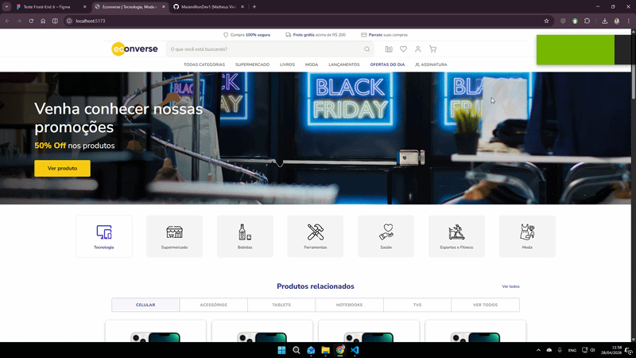

# Econverse — Teste Front-End Júnior

Landing page de e-commerce desenvolvida como teste técnico para a vaga de Desenvolvedor Front-End Júnior na Econverse.

<p align="center">
  
</p>

## Stack

- React 18
- TypeScript 4.9.5
- Vite
- Sass (tradicional)
- Biome (linter/formatter)

## Funcionalidades

- Layout fiel ao Figma pixel a pixel
- Vitrine de produtos consumindo API REST
- Fallback automático para dados locais (caso CORS bloqueie a API)
- Modal de produto com imagem, nome, descrição, preço e botão de compra
- Responsividade completa (desktop, tablet e mobile)
- SEO básico com meta tags
- HTML semântico com aria-labels

## Como rodar localmente

**Pré-requisitos:** Node.js 18+ e npm

```bash
# 1. Clone o repositório
git clone https://github.com/SEU_USUARIO/econverse-frontend.git
cd econverse-frontend

# 2. Instale as dependências
npm install

# 3. Inicie o servidor de desenvolvimento
npm run dev
```

Acesse `http://localhost:5173`

## Build para produção

```bash
npm run build
npm run preview
```

## Linting

```bash
npm run lint
```


## Estrutura do projeto

```
src/
  assets/
    images/          # Imagens e ícones do layout
  components/
    Header/          # Barra promocional topo
    Hero/            # Banner principal Black Friday
    Categories/      # Seção de categorias com ícones
    ProductSection/  # Vitrine com tabs de categorias
    ProductCard/     # Card individual de produto
    ProductModal/    # Modal ao clicar em produto
    Brands/          # Seção parceiros e marcas
    Newsletter/      # Formulário de newsletter
    Footer/          # Rodapé completo
  data/
    products.json    # Mock local (fallback CORS)
  interfaces/
    Product.ts       # Tipagem TypeScript
  services/
    api.ts           # Fetch com fallback automático
  styles/
    global.scss      # Reset + variáveis globais
  App.tsx
  main.tsx
```

## Decisões técnicas

- **Sass tradicional** ao invés de CSS Modules para evitar erros de tipagem em ambientes sem plugin de types
- **Fallback local** implementado no `services/api.ts` — a API é tentada primeiro e, em caso de CORS ou erro, os dados locais são usados automaticamente
- **Medidas em px** conforme solicitado no teste
